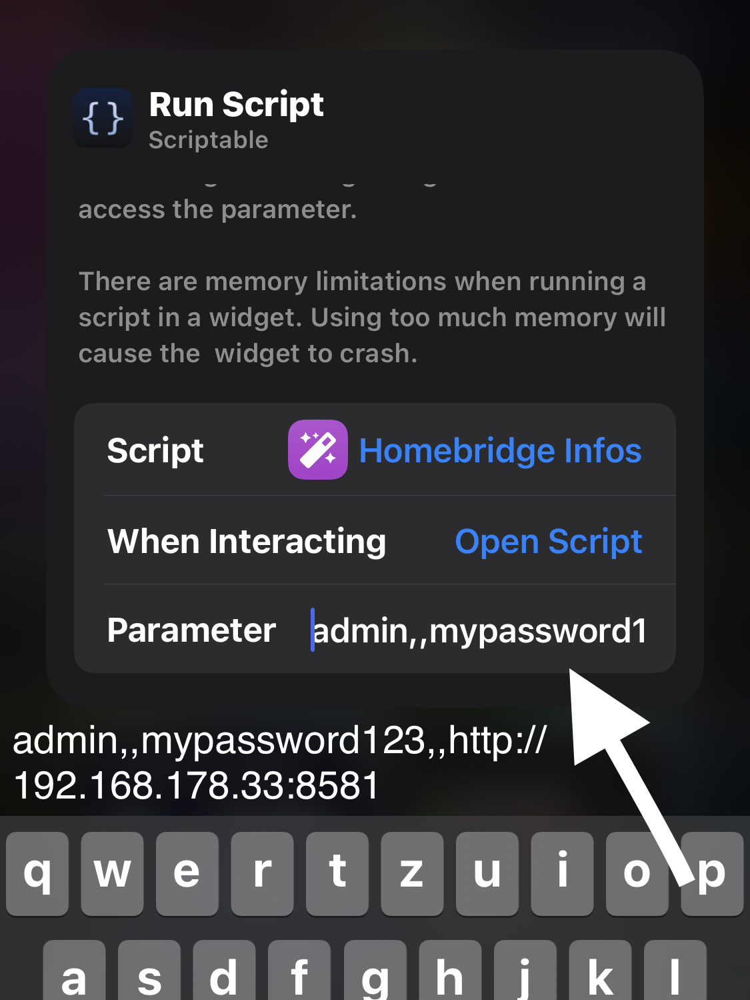
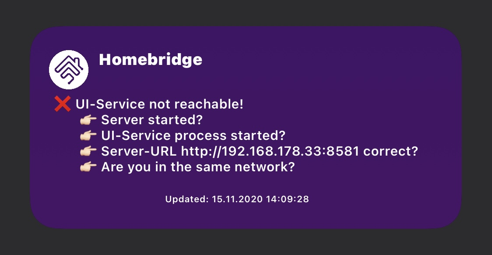
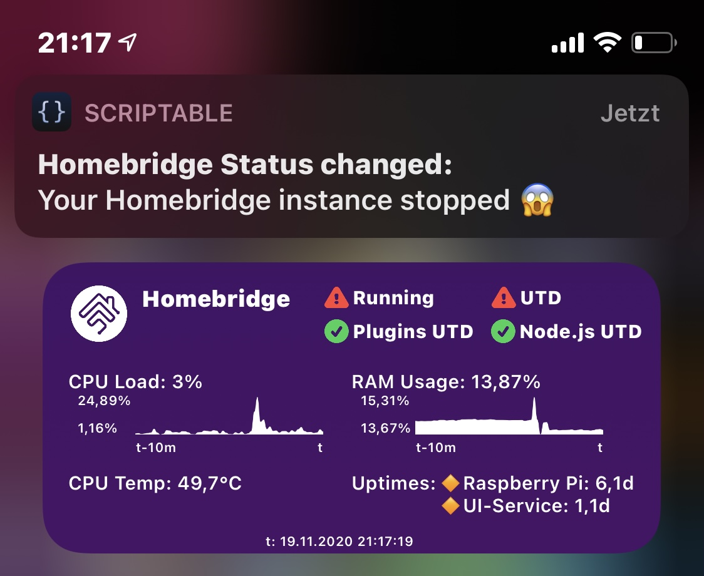
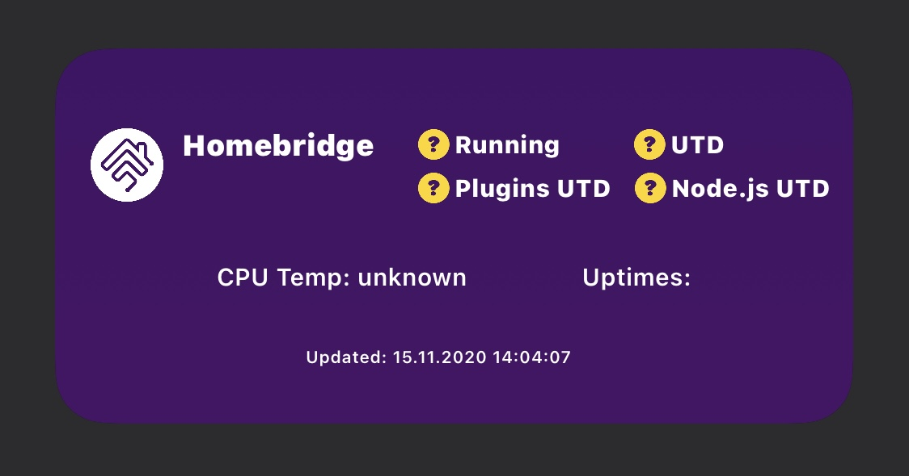

# Homebridge Status Widget
- Script for the iOS App Scriptable that shows a small summary of your Homebridge instance
- All infos shown are based and provided by the Homebridge Config UI X found at https://github.com/oznu/homebridge-config-ui-x
- Thanks to the github user oznu for providing such a nice programm!
- This script does not work if you don't have the Homebridge service (Homebridge Config UI X) running
- This script was developed with Homebridge Config UI X in version 4.32.0 (2020-11-06), Homebridge at version 1.1.6 and Scriptable app in version 1.6.1 on iOS 14.2. Maybe you need to update the UI-service OR Homebridge OR the Scriptable app OR your iPhone if this script does not work for you
- also thanks to github user kevinkub for providing a line chart example at https://gist.github.com/kevinkub/b74f9c16f050576ae760a7730c19b8e2

# How to use
- updatable way supporting the install script from https://scriptdu.de (very recommended):
   - set the widget up with parameter in the format \<username>,,\<password>,,\<hbServiceMachineBaseUrl>
   - a valid real example: "admin,,mypassword123,,http://192.168.178.33:8581"
   - screenshot of an example when setting it up: 
   
- hard coded way: you need to configure 
   - the **URL** of the system running the Homebridge Config UI X (the hb-service), including the port e.g. http://192.168.178.33:8581
   - **username** of the administrator of the homebridge-config-ui-x instance (not the actual linux user)
   - **password** of the administrator of the homebridge-config-ui-x instance
- the residual parameter can be tweaked a bit for your needs
   - e.g. fileManagerMode, must be set to LOCAL if you do not use iCloud Drive. Default is ICLOUD
   - e.g. the systemGuiName, the name of your system running the Homebridge Config UI X (the hb-service)
   - e.g. the timeout could be increased if your system does not respond within 2 second
   - e.g. set the temperatureUnitConfig to 'FAHRENHEIT' to use °F instead of °C
- if your homebridge-config-ui-x instance is not reached within the specified timeout (currently 2sec) the following screen is shown: 

# Notifications
- the widget now can notify you when a status has changed
- you will get a notification if:
  - your Homebridge stopped running
  - there is an update available for Homebridge
  - there is an update available for one of your plugins
  - there is an update available for node.js
- disable notifications by setting notificationEnabled to false
- enable getting notification when any status was yellow and is now back to normal by setting the variable disableStateBackToNormalNotifications to false
- edit the variable notificationIntervalInDays to lengthen or shorten the time between getting the same notification (e.g. plugin update available) again
  - 0 means you get a notification every time the script runs (not recommended)
  - 1 means you get each possible notification to a maximum of 1 time per day
  - 0.5 means you get each possible notification to a maximum of 2 times per day
- Open a notification to reveal the "Show me!" button which takes you directly to Homebridge Config UI X
- Here are some screenshots: 

# Ignoring specific plugins or software
- by filling the empty array of the variable pluginsOrSwUpdatesToIgnore with strings, you can now configure to ignore plugins, Homebridge or Node.js during checking for updates
- succesfully ignored software will not influence the shown status (e.g. ignoring homebridge UTD status will result in showing the green status always even if there is an update available)
  - for ignoring plugins, enter their npm name (e.g. 'homebridge-fritz') as string in the given empty array 
  - for ignoring Homebridge enter 'HOMEBRIDGE_UTD' and for Node enter 'NODEJS_UTD' in the empty array
  - a valid example of the variable would be const pluginsOrSwUpdatesToIgnore = ['homebridge-fritz', 'HOMEBRIDGE_UTD', 'NODEJS_UTD'];
  - if you specify something and run the script inside the Scriptable app, you will get a log output to let you know that you ignored something successfully

# Styling
- at the top of the script there is a variable bgColorMode that you can set to 'BLACK' to use the black variant which looks as the following:

- you can also change the icons failIcon = ❌ and bulletPointIcon = 🔸 by providing any other emoji

# Infos shown in the widget
- if Homebridge is running
- if Homebridge is up to date
- if all of the installed plugins (including Homebridge Config UI X) are up to date
- if node.js is up to date
- CPU load
- CPU temperature
- RAM usage
- Uptime for the system the hb-service is running on
- Uptime for the hb-service (Homebridge Config UI X)

# Troubleshoot
- if the temperature is not shown for you, then the information is not available on your machine
- triple check the credentials (2FA currently not supported)
- consider increasing the requestTimeoutInterval variable
- if some error occurs always check that you have the matching versions
  - the Scriptable app 1.6.1
  - Homebridge Config UI X 4.32.0 (2020-11-06)
  - Homebridge 1.1.6
  - iOS 14.2
- if your Homebridge Config UI X is reachable and the authentication process succeeded but the further API requests take to long or fail you will get a screen similar to 